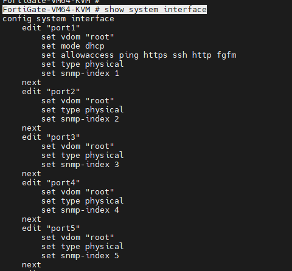
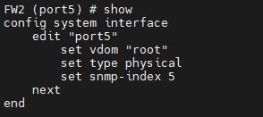
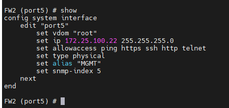

# Basic Configurations

#### <mark style="color:orange;">Hostname Config</mark>


```bash
FortiGate-VM64-KVM # config system global
FortiGate-VM64-KVM (global) # set hostname FW2
FortiGate-VM64-KVM (global) # end
FW2 #
```

#### &#x20;<mark style="color:orange;">Interface Troubleshoot & configuration</mark>

&#x20;To verify the interface configuration input _**show system interface**_ in cli will display the listed interface along with it's configuration as shown in the **fig 1.1**

```bash
FortiGate-VM64-KVM # show system interface
```

<figure><figcaption><p>Fig 1.1</p></figcaption></figure>

```bash
FW2#config system interface
```

```bash
FW2 (config)# edit port5
FW2 (port5) # show

```

<figure><figcaption><p>Fig 1.2</p></figcaption></figure>

```bash
FW2 (port5) # set mode static
FW2 (port5) # set ip 172.25.100.22/24
FW2 (port5) # set allowaccess https http ping telnet ssh
FW2 (port5) # set alias "MGMT"
FW2 (port5) # end

```

<figure><figcaption><p>Fig 1.3</p></figcaption></figure>
